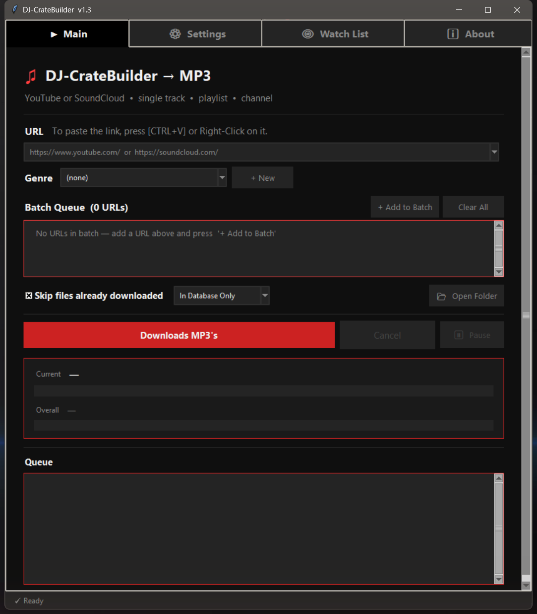
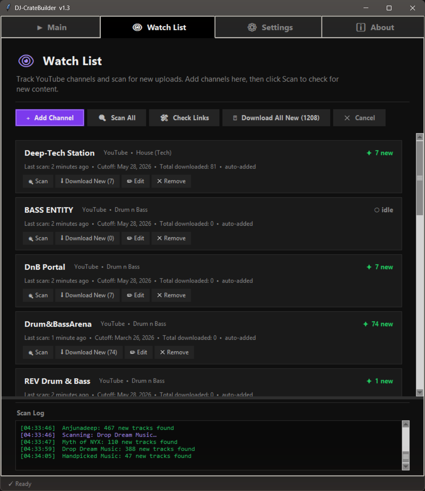
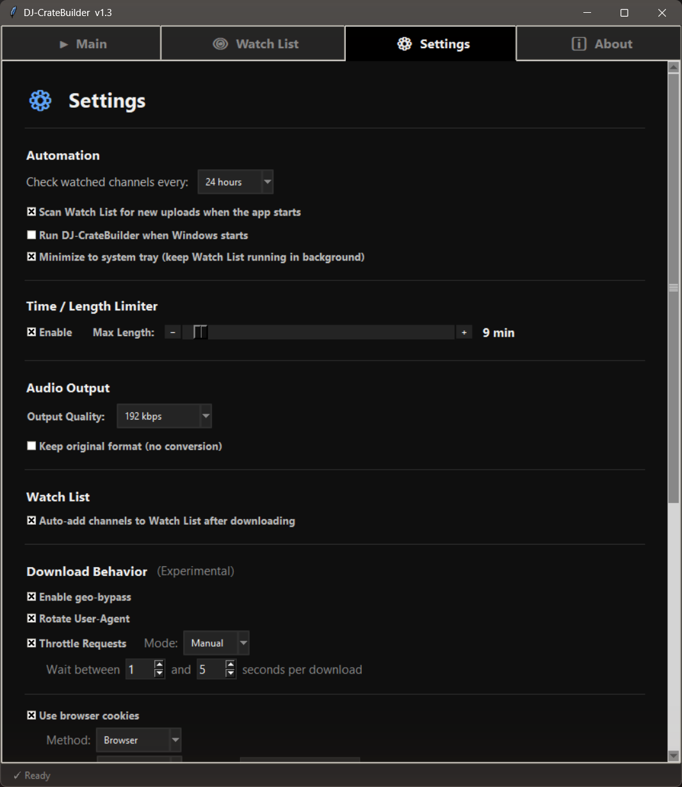
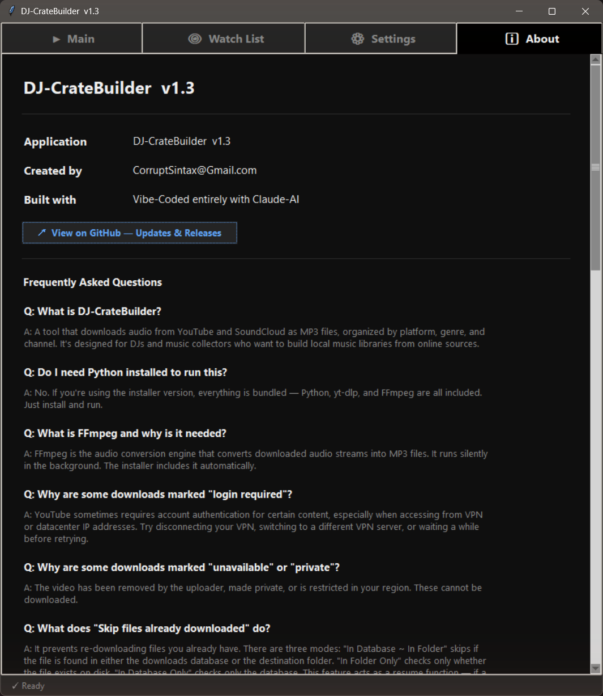

#  DJ-CrateBuilder v1.3 

A desktop application for batch-downloading audio from YouTube and SoundCloud as MP3 files, organized by platform, genre, and channel — like a digital record crate for DJs and music collectors. 

  

---

## Contents

- <sub>[Screenshots](#screenshots)</sub>
- <sub>[Features](#features)</sub>
- <sub>[Requirements](#requirements)</sub>
- <sub>[Installation](#installation)</sub>
- <sub>[Updates & Antivirus Notice](#updates)</sub>
- <sub>[Usage](#usage)</sub>
- <sub>[Browser Cookie Authentication](#browser-cookie-authentication)</sub>
- <sub>[Settings](#settings)</sub>
- <sub>[Building from Source](#building-from-source)</sub>
- <sub>[File Locations](#file-locations)</sub>
- <sub>[FAQ](#faq)</sub>
- <sub>[Known Limitations](#known-limitations)</sub>
- <sub>[Tech Stack](#tech-stack)</sub>
- <sub>[Disclaimer](#disclaimer)</sub>
- <sub>[Contributing](#contributing)</sub>
- <sub>[Version History](#version-history)</sub>

---

<a name="screenshots"></a>

## Screenshots&nbsp;&nbsp;<sub>[↑ Contents](#contents)</sub>

<p align="left">
  
</p>

<p align="left">
  
  
  
</p>

---

<a name="features"></a>

## Features&nbsp;&nbsp;<sub>[↑ Contents](#contents)</sub>

- **Watch List** — Track your favourite YouTube and SoundCloud channels and periodically scan for *only* genuinely-new uploads, so you never re-download tracks you already own. YouTube channels are identified by their canonical channel ID (with a built-in search resolver to heal broken links) while SoundCloud artists are tracked by their profile URL, new uploads are cross-referenced against what's already in your folders, and per-channel cards let you Fix Link (shown only when a link needs healing), Scan, Download New, Edit, or Cancel at any time — all alongside a pinned, resizable scan log. Every tracked entry is re-scanned in the background on launch so the new-track counts are always current *(new in v1.3)*
- **Background Automation** — Let the Watch List run on its own: every launch the app refreshes the new-track counts for all entries (YouTube and SoundCloud) in the background, and you can pick a check interval (Off / 6 / 12 / 24 / 48 hours) so DJ-CrateBuilder periodically scans every tracked channel and auto-downloads new tracks to their folders, notifying you when it does. Optionally launch at Windows startup and minimize to the system tray so it keeps watching while you work *(new in v1.3)*
- **Batch Queue** — Add multiple URLs (channels, playlists, single videos) and process them in sequence
- **Auto-Organization** — Downloads are sorted into folders by platform, genre, and channel name
- **MP3 Conversion** — Converts all audio to MP3 at your chosen bitrate (128 / 192 / 256 / 320 kbps)
- **Skip Existing** — Detects previously downloaded files by log history and/or folder scan, doubling as a resume function for interrupted batches
- **Time Limiter** — Automatically skip tracks longer than a set duration to filter out mixes, podcasts, and full albums
- **Browser Cookie Authentication** — Authenticate with a YouTube account for faster downloads and fewer restrictions (supports Firefox, Chrome, Edge, Brave, and cookie file export)
- **Throttle Controls** — Random delays between downloads with Auto presets or Manual min/max to avoid rate limiting
- **User-Agent Rotation** — Randomized browser fingerprints per session
- **Geo-Bypass** — Attempt to bypass geographic IP restrictions
- **Downloads Log** — Timestamped record of every download, skip, and error (`activity.log`) with a built-in color-coded log viewer
- **Debug Log** — Separate diagnostic log (`debug.log`) capturing yt-dlp options, cookie configuration, and full error tracebacks for troubleshooting *(new in v1.3)*
- **URL History** — The URL field remembers your last 6 inputs
- **Channel Auto-Detection** — Bare channel URLs (youtube.com/@Name) automatically resolve to the full video list
- **Dark Themed UI** — Purpose-built dark interface using tkinter

---

<a name="requirements"></a>

## Requirements&nbsp;&nbsp;<sub>[↑ Contents](#contents)</sub>

- **Python 3.10+**
- **yt-dlp**, **pystray**, **Pillow** — `pip install -r requirements.txt` (pystray + Pillow power the system-tray icon)
- **FFmpeg** — must be on PATH or in the same directory as the script
- **tkinter** — included with standard Python installations on Windows

---

<a name="installation"></a>

## Installation&nbsp;&nbsp;<sub>[↑ Contents](#contents)</sub>
## &nbsp;&nbsp;
### Windows Installer

Download the latest installer from the [Releases](https://github.com/Sintax/DJ-CrateBuilder/releases) page. The installer bundles Python, yt-dlp, and FFmpeg — no additional setup required.

<hr style="border:0; border-top:1px solid #30363d; height:0;">

### Windows Quick Setup (install-windows.bat)

The fastest way to get running on Windows. Right-click `install-windows.bat` and choose **Run as administrator**. The script automatically:

- Checks for Python 3.10+ (and downloads/installs Python 3.12 if it's missing)
- Verifies tkinter is available
- Upgrades pip and installs yt-dlp
- Checks for FFmpeg and shows install options if it's not on PATH
- Creates a Desktop shortcut and offers to launch the app

<hr style="border:0; border-top:1px solid #30363d; height:0;">

### Run from Source

```bash
git clone https://github.com/Sintax/DJ-CrateBuilder.git
cd DJ-CrateBuilder
pip install -r requirements.txt
python DJ-CrateBuilder_v1.3.py
```

<hr style="border:0; border-top:1px solid #30363d; height:0;">

### Linux

Prerequisites: Python 3.10+, tkinter, FFmpeg, yt-dlp.

```bash
# Install dependencies (Ubuntu/Debian)
sudo apt install python3 python3-tk ffmpeg
pip install yt-dlp

# Clone and install
git clone https://github.com/Sintax/DJ-CrateBuilder.git
cd DJ-CrateBuilder
chmod +x install-linux.sh
./install-linux.sh
```

After installation, launch with `dj-cratebuilder` from terminal or find it in your app launcher. To uninstall: `./uninstall-linux.sh`

---

<a name="updates"></a>

## Updates & Antivirus Notice&nbsp;&nbsp;<sub>[↑ Contents](#contents)</sub>

DJ-CrateBuilder can update itself. The **About** tab shows your current build
(for example `v1.3.1`) and a **Check for updates** button; the app also checks
quietly in the background once every few hours. Small fixes ship as **nightly
builds** that bump only the build number — the version stays `1.3`. When a newer
build is found, the app downloads it, verifies it with a SHA-256 checksum, then
closes, swaps the files, and relaunches itself — one click, like a normal update.

### Windows SmartScreen & antivirus (please read)

DJ-CrateBuilder is **not code-signed** — code-signing certificates are expensive
for a small, free side project. Because of that, Windows may show warnings:

- **SmartScreen on first install/run:** a blue *"Windows protected your PC"*
  box. Click **More info → Run anyway**. (It looks scary; it just means the app
  has no paid certificate.)
- **Windows Defender / antivirus during updates:** the updater downloads a file
  and replaces the app's program files, which some antivirus tools flag as a
  **false positive**. The app warns you about this **before** each update starts.

**This is expected and safe.** Every update comes straight from the official
[GitHub repository](https://github.com/Sintax/DJ-CrateBuilder) and is verified
with a SHA-256 checksum before anything is installed.

If an update is blocked:

1. Choose **Run anyway** / **Allow** if Windows or your antivirus prompts you.
2. Or add DJ-CrateBuilder's install folder to your antivirus exclusions.
3. Or download the latest build manually from the
   [Releases page](https://github.com/Sintax/DJ-CrateBuilder/releases) and run it.

> Running from source (not the installer)? There's nothing to self-update —
> just `git pull` the latest changes.

---

<a name="usage"></a>

## Usage&nbsp;&nbsp;<sub>[↑ Contents](#contents)</sub>

1. **Select a platform** — YouTube or SoundCloud
2. **Paste a URL** — Single video, playlist, or entire channel
3. **Choose a genre** — Select from existing genres or create a new one (optional)
4. **Add to Batch** — Queue multiple URLs, or download a single URL directly
5. **Press Download MP3's** — The batch processes sequentially with real-time progress

### Folder Structure

```
~/Music/DJ-CrateBuilder/
├── YouTube/
│   ├── Drum & Bass/
│   │   ├── ChannelName -(Complete Catalog)-/
│   │   │   ├── Track Title.mp3
│   │   │   └── ...
│   │   └── Single Track.mp3
│   ├── House/
│   └── _No Genre/
└── SoundCloud/
    └── ...
```

---

<a name="browser-cookie-authentication"></a>

## Browser Cookie Authentication&nbsp;&nbsp;<sub>[↑ Contents](#contents)</sub>

For faster downloads and fewer "login required" errors, you can authenticate with a YouTube account.

**Recommended setup:** Create a dedicated/throwaway Google account for this purpose — do not use your personal account.

### Method 1 — Browser Profile (Firefox recommended)

1. Create a separate browser profile
2. Log into the throwaway YouTube account in that profile
3. In DJ-CrateBuilder Settings → Download Behavior → Use Browser Cookies
4. Select your browser and enter the profile name

### Method 2 — Cookie File

1. Install the "Get cookies.txt LOCALLY" browser extension
2. Navigate to youtube.com while logged into the throwaway account
3. Export cookies to a `.txt` file
4. In DJ-CrateBuilder Settings → Download Behavior → Use Browser Cookies
5. Select "Cookie File" method and browse to the exported file

> **Note:** Chrome 127+ blocks cookie extraction via DPAPI encryption. Use Firefox or the cookie file method instead.

---

<a name="settings"></a>

## Settings&nbsp;&nbsp;<sub>[↑ Contents](#contents)</sub>

| Setting | Default | Description |
|---------|---------|-------------|
| Time Limiter | 8 min | Skip tracks exceeding this duration |
| MP3 Bitrate | 192 kbps | Output quality (128 / 192 / 256 / 320) |
| Skip Existing | In Logs ~ In Folder | Prevent re-downloading completed files |
| Geo-Bypass | Off | Bypass geographic restrictions |
| Rotate User-Agent | On | Randomize browser fingerprint per session |
| Throttle Requests | On / Light | Random delay between downloads |
| Browser Cookies | Off | Authenticate with a YouTube account |
| Auto-add to Watch List | On | Add channels to the Watch List after downloading |
| Check for new tracks every | 24 hours | Background auto-scan interval for the Watch List (Off / 6 / 12 / 24 / 48 hours) |
| Run at Windows startup | Off | Launch DJ-CrateBuilder automatically when you log in |
| Minimize to system tray | Off | Closing the window hides it to the tray and keeps the Watch List running |

All settings auto-save and persist between sessions.

---

<a name="building-from-source"></a>

## Building from Source&nbsp;&nbsp;<sub>[↑ Contents](#contents)</sub>

### Create Windows Executable

```bash
pip install pyinstaller -r requirements.txt
pyinstaller --noconfirm --clean --name "DJ-CrateBuilder" --windowed --onedir ^
  --collect-submodules cratebuilder ^
  --hidden-import pystray._win32 --hidden-import PIL.ImageDraw ^
  --hidden-import send2trash ^
  DJ-CrateBuilder_v1.3.py
```

The `--collect-submodules`/`--hidden-import` flags bundle the local `cratebuilder/`
package, the lazily-imported tray dependencies (pystray + Pillow), and send2trash
(used by Folders Cleanup to move files to the Recycle Bin). Copy
`ffmpeg.exe` and `ffprobe.exe` into `dist\DJ-CrateBuilder\`.

### Create Installer

Use [Inno Setup 6](https://jrsoftware.org/isinfo.php) with the included `docs/DJ-CrateBuilder_Installer_Windows.iss` file. Generate a unique GUID for the `AppId` field before compiling.

See [docs/Packaging_Guide.md](docs/Packaging_Guide.md) for detailed instructions.

---

<a name="file-locations"></a>

## File Locations&nbsp;&nbsp;<sub>[↑ Contents](#contents)</sub>

| File | Path |
|------|------|
| Config | `~/.dj_cratebuilder_config.json` |
| Activity log | `<install dir>/activity.log` |
| Debug log | `<install dir>/debug.log` *(new in v1.3)* |
| Downloads | `~/Music/DJ-CrateBuilder/YouTube/` or `.../SoundCloud/` |

---

<a name="faq"></a>

## FAQ&nbsp;&nbsp;<sub>[↑ Contents](#contents)</sub>

See the built-in FAQ in the app's About tab for answers to common questions about bitrate, skip logic, throttle presets, folder organization, and more.

---

<a name="known-limitations"></a>

## Known Limitations&nbsp;&nbsp;<sub>[↑ Contents](#contents)</sub>

- **Chrome 127+** blocks cookie extraction due to DPAPI encryption — use Firefox or export a cookie file
- **Age-restricted videos** require age verification on the throwaway account, or the app falls back to anonymous download (which bypasses age gates via YouTube's embedded player)
- **YouTube rate limiting** may occur during large batch downloads — enable Throttle Requests with Moderate or Aggressive presets for 200+ file batches
- **VPN users** may encounter "login required" errors from YouTube — enabling Browser Cookies typically resolves this

---

<a name="tech-stack"></a>

## Tech Stack&nbsp;&nbsp;<sub>[↑ Contents](#contents)</sub>

- **Python 3** with tkinter (GUI)
- **yt-dlp** (download engine)
- **FFmpeg** (audio conversion)
- **pystray + Pillow** (system-tray icon and notifications)
- **PyInstaller** (packaging)
- **Inno Setup** (Windows installer)

---

<a name="disclaimer"></a>

## Disclaimer&nbsp;&nbsp;<sub>[↑ Contents](#contents)</sub>

This tool is intended for downloading audio that you have the right to access. Respect copyright laws and the terms of service of the platforms you use. The developers are not responsible for misuse of this software.

---

<a name="contributing"></a>

## Contributing&nbsp;&nbsp;<sub>[↑ Contents](#contents)</sub>

This project is in active development. Bug reports, feature requests, and pull requests are welcome.

The pure-logic core lives in the `cratebuilder/` package (config, channel sidecars, the downloads DB, Windows run-at-startup, and the tray wrapper) and is covered by a test suite. To run it:

```bash
pip install -r requirements-dev.txt
python -m pytest -q
```

---

<a name="version-history"></a>

## Version History&nbsp;&nbsp;<sub>[↑ Contents](#contents)</sub>

| Version | Date | Highlights |
|---------|------|------------|
| 1.3 | 2026-05 | **Watch List** — YouTube **and SoundCloud** channel tracking with new-upload detection, canonical channel-ID resolution + search-based healing (Fix Link, shown only when needed, with duplicate-entry detection), folder cross-reference dedup, per-card Scan/Download/Edit/Cancel, pinned resizable scan log; **Background Automation** — startup scan refreshing new-track counts for every entry, interval auto-scan (Off/6/12/24/48h, default 24h) with auto-download + tray notifications, run-at-Windows-startup, minimize-to-system-tray; extracted reusable `cratebuilder/` package with a pytest suite; debug log with full yt-dlp/cookie diagnostics, renamed DJ-CrateBuilder.log → activity.log, "Downloads Log" rename, native Linux installer improvements |
| 1.2 | 2026-03 | Browser cookie auth, cookie file support, age-gate retry, format diagnostics, _No Genre folder, URL history, genre confirmation, renamed from YouTube DJ-CrateBuilder |
| 1.1 | 2026-03 | Queue rewrite (Text widget), batch system, throttle presets, geo-bypass, UA rotation, log viewer, Settings tab overhaul |
| 1.0 | 2026-03 | Initial release — single/batch download, genre folders, skip-existing, time limiter, dark UI |
