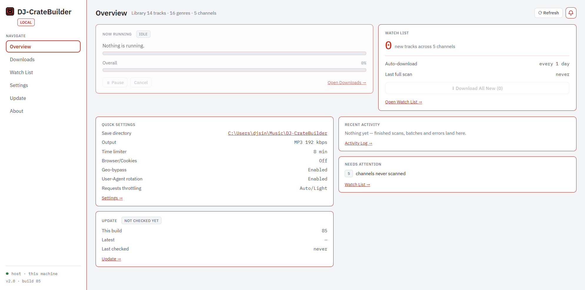
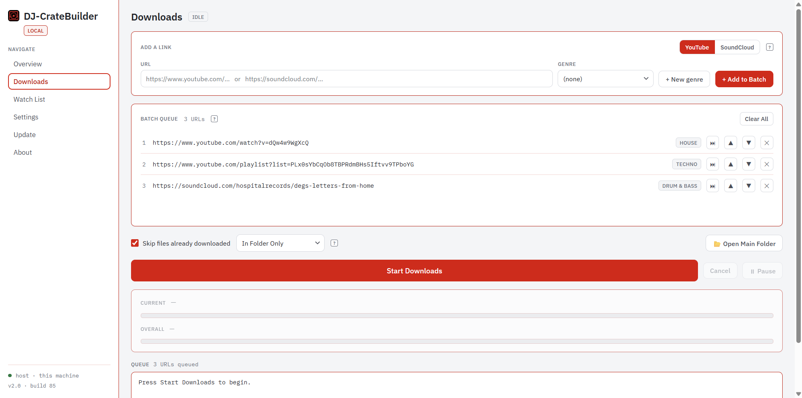
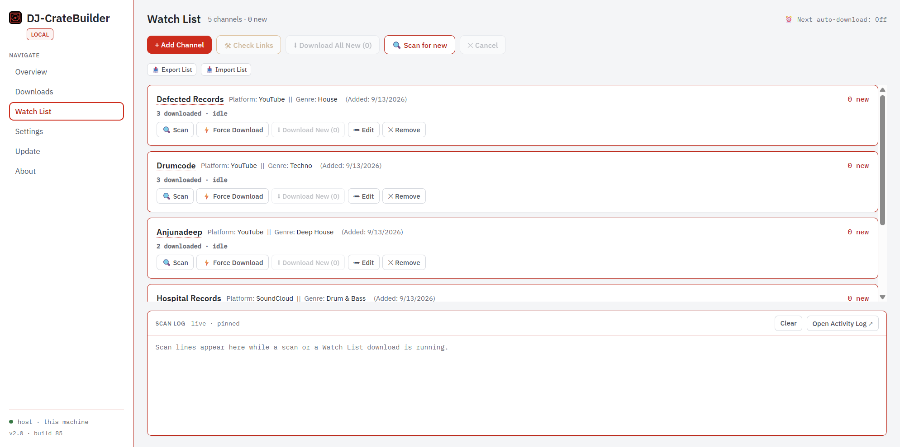
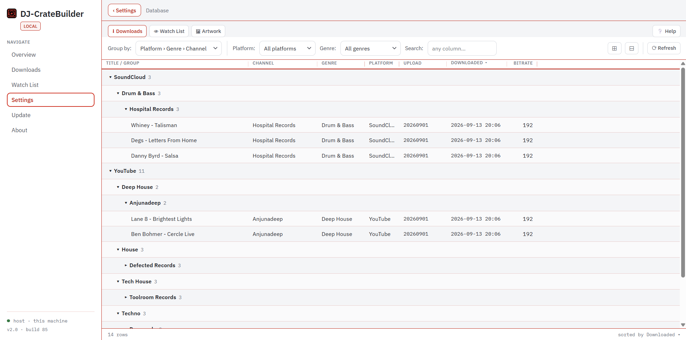
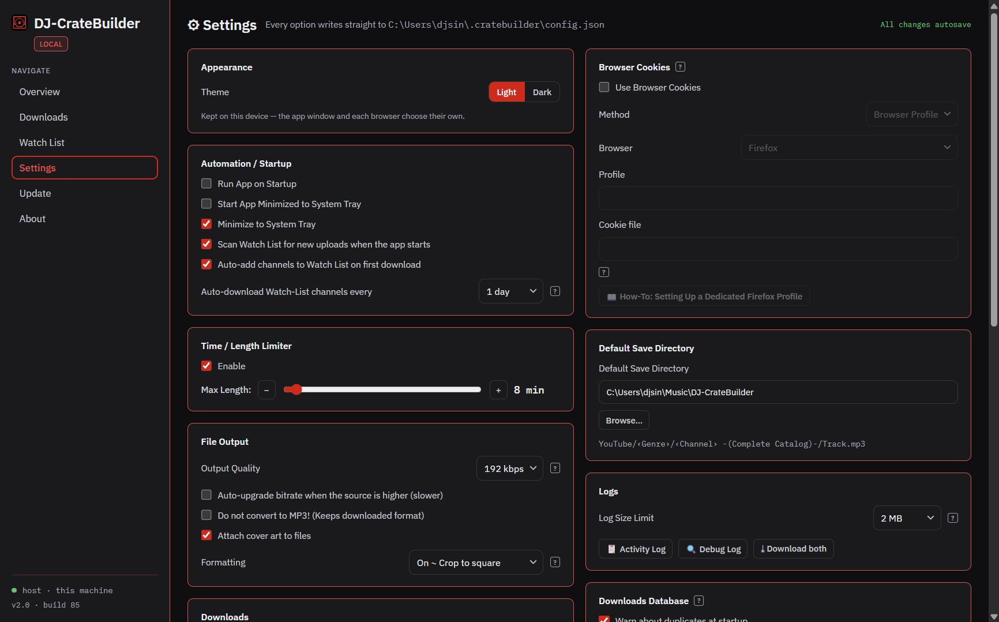
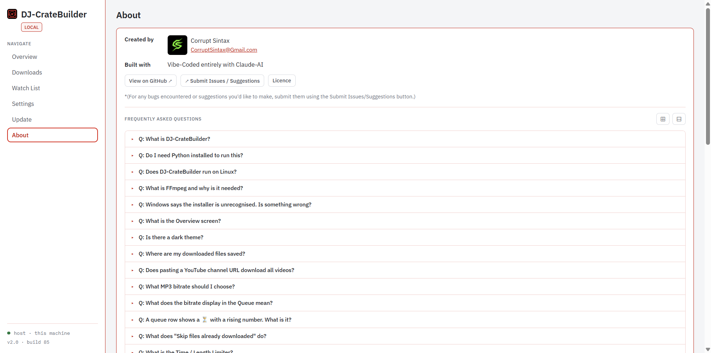

#  DJ-CrateBuilder v2.0

A desktop application for batch-downloading audio from YouTube and SoundCloud as MP3 files, organized by platform, genre, and channel — like a digital record crate for DJs and music collectors.

Version 2.0 is a ground-up interface rework: the app is now a modern web UI running in a native desktop window, with optional remote access so you can drive it from a phone or another computer on your network. Same download engine, same library layout, same database — a new face on everything.

  

---

## Contents

- <sub>[Screenshots](#screenshots)</sub>
- <sub>[What's new in 2.0](#whats-new)</sub>
- <sub>[Features](#features)</sub>
- <sub>[Requirements](#requirements)</sub>
- <sub>[Installation](#installation)</sub>
- <sub>[Updates](#updates)</sub>
- <sub>[Usage](#usage)</sub>
- <sub>[Remote Access](#remote-access)</sub>
- <sub>[Browser Cookie Authentication](#browser-cookie-authentication)</sub>
- <sub>[Settings](#settings)</sub>
- <sub>[Building from Source](#building-from-source)</sub>
- <sub>[File Locations](#file-locations)</sub>
- <sub>[FAQ](#faq)</sub>
- <sub>[Known Limitations](#known-limitations)</sub>
- <sub>[Tech Stack](#tech-stack)</sub>
- <sub>[Disclaimer](#disclaimer)</sub>
- <sub>[Contributing](#contributing)</sub>
- <sub>[Version History](#version-history)</sub>

---

<a name="screenshots"></a>

## Screenshots&nbsp;&nbsp;<sub>[↑ Contents](#contents)</sub>

**Overview** — the dashboard: what's running, what the Watch List found, recent activity, and the host at a glance.



**Downloads** — the batch queue with per-track and overall progress.



**Watch List** — per-channel cards with new-track counts, scan controls, and the pinned scan log.



**Database** — the downloads library, grouped by platform → genre → channel, expandable to every track.



<table>
  <tr>
    <td></td>
    <td></td>
  </tr>
  <tr>
    <td align="center"><sub>Settings</sub></td>
    <td align="center"><sub>About — with the in-app updater</sub></td>
  </tr>
</table>

---

<a name="whats-new"></a>

## What's new in 2.0&nbsp;&nbsp;<sub>[↑ Contents](#contents)</sub>

- **The web UI is the app.** DJ-CrateBuilder now opens as a fast, clean web interface inside a native desktop window (WebView2 on Windows, WebKit on Linux). The old tkinter interface is retired.
- **Remote access, built in.** Switch it on in Settings ▸ Remote Access and pair a phone or laptop with a 6-digit code — then watch batches, run Watch List scans, and manage the library from the couch. Off by default, LAN-only by design, with read-only mode and a single-writer control lock.
- **Overview dashboard.** One screen answers "what is the app doing right now": current job, Watch List status, notifications, recent activity, and host info.
- **Database viewer.** Browse everything you've downloaded, grouped by platform / genre / channel, with search and CSV export.
- **Activity & debug logs in-app.** Both logs get proper viewers with filtering — no more digging for files.
- **Seamless upgrade.** v1.3 installs update straight to 2.0 through the normal in-app updater, keeping your database, config, and library exactly where they are.

---

<a name="features"></a>

## Features&nbsp;&nbsp;<sub>[↑ Contents](#contents)</sub>

- **Watch List** — Track your favourite YouTube and SoundCloud channels and periodically scan for *only* genuinely-new uploads, so you never re-download tracks you already own. YouTube channels are identified by their canonical channel ID (with a built-in search resolver to heal broken links), SoundCloud artists by their profile URL; new uploads are cross-referenced against what's already in your folders, and per-channel cards let you Fix Link, Scan, Download New, Edit, or Cancel at any time — alongside a pinned scan log. Unreleased premieres and scheduled live events are held back from the "new" count instead of failing mid-batch.
- **Background Automation** — Every launch refreshes new-track counts for all tracked channels in the background, and a configurable interval (Off / 6 / 12 / 24 / 48 hours) scans every channel and auto-downloads new tracks to their folders, notifying you when it does. Optionally launch at Windows startup and minimize to the system tray so it keeps watching while you work.
- **Batch Queue** — Add multiple URLs (channels, playlists, single videos) and process them in sequence with per-track and overall progress
- **Auto-Organization** — Downloads are sorted into folders by platform, genre, and channel name
- **MP3 Conversion** — Converts all audio to MP3 at your chosen bitrate (128 / 192 / 256 / 320 kbps)
- **Skip Existing** — Detects previously downloaded files by log history and/or folder scan, doubling as a resume function for interrupted batches
- **Time Limiter** — Automatically skip tracks longer than a set duration to filter out mixes, podcasts, and full albums
- **Browser Cookie Authentication** — Authenticate with a YouTube account for faster downloads and fewer restrictions (supports Firefox, Chrome, Edge, Brave, and cookie file export)
- **Throttle Controls** — Random delays between downloads with Auto presets or Manual min/max to avoid rate limiting
- **User-Agent Rotation** — Randomized browser fingerprints per session
- **Geo-Bypass** — Attempt to bypass geographic IP restrictions
- **Cover Art** — Embeds the source thumbnail into each MP3 so cover art shows in Explorer, media players, and on mobile, with Crop-to-square or Keep-original-aspect modes; a **Fetch Missing Cover Art** backfill tool covers older tracks
- **Tag Repair** — A **Repair Track Tags** backfill tool realigns genre tags with the folder each track is filed under and fills in missing Title, Encoded-by, or source URL. Changing a Watch List channel's genre also retags its already-downloaded files to match
- **Database Viewer & Maintenance** — Browse the full downloads library grouped by platform / genre / channel, export to CSV, and run maintenance tools like **Remove Duplicates** *(viewer new in v2.0)*
- **Downloads & Debug Logs** — Timestamped record of every download, skip, and error (`activity.log`) plus a separate diagnostic log (`debug.log`) with yt-dlp/cookie details — both with built-in viewers *(in-app viewers new in v2.0)*
- **Remote Access** — Pair another device with a one-time code and control the app from a browser on your network *(new in v2.0 — see [Remote Access](#remote-access))*
- **In-App Updates** — SHA-256-verified nightly builds installed from the About screen
- **URL History** — The URL field remembers your recent inputs
- **Channel Auto-Detection** — Bare channel URLs (youtube.com/@Name) automatically resolve to the full video list

---

<a name="requirements"></a>

## Requirements&nbsp;&nbsp;<sub>[↑ Contents](#contents)</sub>

The Windows installer and the Linux `.deb` bundle or install everything below automatically — this list matters only if you run from source.

- **Python 3.10+**
- **Python packages** — `pip install -r requirements.txt` (yt-dlp, pywebview, fastapi, uvicorn, Pillow, and friends)
- **FFmpeg** — must be on PATH or in the same directory as the app
- **Windows**: the WebView2 runtime (preinstalled on Windows 10/11)
- **Linux**: the GTK/WebKit stack — `python3-gi`, `python3-gi-cairo`, `gir1.2-gtk-3.0`, `gir1.2-webkit2-4.1` (or `-4.0`)

---

<a name="installation"></a>

## Installation&nbsp;&nbsp;<sub>[↑ Contents](#contents)</sub>

### Windows Installer

Download the latest installer from the [Releases](https://github.com/Sintax/DJ-CrateBuilder/releases) page. The installer bundles Python, yt-dlp, and FFmpeg — no additional setup required.
##

### Windows Quick Setup (install-windows.bat)

The fastest way to get running from a source checkout on Windows. Right-click `install-windows.bat` and choose **Run as administrator**. The script automatically:

- Checks for Python 3.10+ (and downloads/installs Python 3.12 if it's missing)
- Upgrades pip and installs the Python dependencies from `requirements.txt`
- Checks for FFmpeg and shows install options if it's not on PATH
- Creates a Desktop shortcut and offers to launch the app
##

### Run from Source

```bash
git clone https://github.com/Sintax/DJ-CrateBuilder.git
cd DJ-CrateBuilder
pip install -r requirements.txt
python web_window.py
```

`python web_window.py --screen watchlist` opens straight to a screen — `overview`, `downloads`, `watchlist`, `settings`, `about`, `database`, `activity-log` or `debug-log`.
##

### Linux

**Option 1 — Linux Mint / Ubuntu / Debian package (recommended).** Download the latest `.deb` from the [Linux release page](https://github.com/Sintax/DJ-CrateBuilder/releases/tag/linux-v2.0) and double-click it — Mint's package installer handles everything (or from a terminal: `sudo apt install ./dj-cratebuilder_*_all.deb`). Dependencies install automatically, DJ-CrateBuilder appears in your app menu, and it uninstalls cleanly through the Software Manager.

**Option 2 — one-file installer script.** Download **`install-linux.sh`** from this repo, then run it:

```bash
bash install-linux.sh
```

That's it. The installer auto-installs any missing system packages (Python,
the GTK/WebKit stack, FFmpeg — you'll be asked for your password), downloads
the app from GitHub itself, builds a virtual environment, and adds a menu
entry. No `git`, no `chmod`, and don't prefix it with `sudo` — the script asks
for your password only when it needs to. Run it with `bash install-linux.sh`
(rather than `./install-linux.sh`) so a freshly-downloaded file works without
setting the execute bit.

<details>
<summary>Manual install (for people comfortable with the terminal)</summary>

Prerequisites: Python 3.10+, the GTK/WebKit stack, FFmpeg. The installer
creates its own virtual environment and installs the Python packages (yt-dlp,
pywebview, fastapi, …) into it — so on modern Debian/Ubuntu/Mint you do
**not** run `pip install` yourself (it would fail with
`externally-managed-environment` / PEP 668).

```bash
# Install system prerequisites (Ubuntu/Debian/Mint)
sudo apt install python3 python3-venv python3-gi python3-gi-cairo \
    gir1.2-gtk-3.0 gir1.2-webkit2-4.1 ffmpeg git

# Clone and install (the installer builds a venv for you)
git clone https://github.com/Sintax/DJ-CrateBuilder.git
cd DJ-CrateBuilder
bash install-linux.sh
```

</details>

After installation, launch with `dj-cratebuilder` from terminal or find it in your app launcher. To uninstall: `bash uninstall-linux.sh`

> The v2.0 Linux package is a fresh port and hasn't had wide testing yet — if something misbehaves on your distro, please [open an issue](https://github.com/Sintax/DJ-CrateBuilder/issues).

---

<a name="updates"></a>

## Updates&nbsp;&nbsp;<sub>[↑ Contents](#contents)</sub>

DJ-CrateBuilder can update itself. The **About** screen shows a **Check for
updates** button that flips to **Update Now** once a newer nightly build is
found, and the app also checks quietly in the background on a configurable
interval. The display version stays pinned at `2.0` — only the build number
advances between nightly updates. Update files come straight from the official
[GitHub repository](https://github.com/Sintax/DJ-CrateBuilder) and are SHA-256
verified before anything is installed.

**Upgrading from v1.3?** Nothing to do — the same updater channel carries 2.0,
so your existing install offers it as a normal update and keeps your database,
config, and music library untouched.

The app isn't code-signed, so Windows SmartScreen may show a warning on first
install/run — click **More info → Run anyway**; this is expected for
certificate-free freeware.

> Running from source (not the installer)? There's nothing to self-update —
> just `git pull` the latest changes. On Linux, the app notifies you when a
> newer `.deb` is published; installing it is a manual download.

---

<a name="usage"></a>

## Usage&nbsp;&nbsp;<sub>[↑ Contents](#contents)</sub>

1. **Paste a URL** — Single video, playlist, or entire channel (YouTube or SoundCloud — the platform is detected automatically)
2. **Choose a genre** — Select from existing genres or create a new one (optional)
3. **Add to Batch** — Queue multiple URLs, or download a single URL directly
4. **Press Start** — The batch processes sequentially with real-time progress on the Downloads screen

### Folder Structure

```
~/Music/DJ-CrateBuilder/
├── YouTube/
│   ├── Drum & Bass/
│   │   ├── ChannelName -(Complete Catalog)-/
│   │   │   ├── Track Title.mp3
│   │   │   └── ...
│   │   └── Single Track.mp3
│   ├── House/
│   └── _No Genre/
└── SoundCloud/
    └── ...
```

---

<a name="remote-access"></a>

## Remote Access&nbsp;&nbsp;<sub>[↑ Contents](#contents)</sub>

The same interface the desktop window shows can be reached from a browser on
another device — start a batch from your laptop, check a scan from your phone.

First switch it on: **Settings ▸ Remote Access ▸ "Allow remote control over
the internet"**. Until that is on, every remote route refuses — the toggle is
the consent, and it is off by default. Read-only mode and a single-writer
control lock live on the same card, along with the list of paired devices and
a revoke button.

With the toggle on, the desktop app serves remote devices itself. You can also
run a headless server without the window:

```bash
python web_server.py                # binds 127.0.0.1 only
python web_server.py --lan          # binds 0.0.0.0 — needs the toggle above
```

The server listens on port 8770 and prints a **6-digit pairing code**. Open
`http://<host>:8770/` on the other device, type the code, and that browser is
paired: it stores a long-lived device token and does not ask again. Codes last
five minutes and work once (`--pair` prints a fresh one). An unpaired browser
reaches the pairing screen and nothing else.

Plain HTTP is **LAN-only by design**. For anything reaching further, terminate
TLS upstream (Caddy, or a Cloudflare Tunnel) rather than in the app — and tell
the server the public name it will be reached by:

```bash
python web_server.py --lan --host-allow crate.example.com
```

Without it the DNS-rebinding defence refuses the proxy's `Host` header. The
name is remembered, so `--host-allow` is a one-time setup flag. Both entry
points accept it.

**What remote sessions can't do, on purpose:** install updates and browse the
host's filesystem. Those work only in the desktop window on the machine
itself.

Notifications (the bell on Overview, and the Recent activity card beside it)
are kept **per browser**, not on the host — a device you have just paired
starts with an empty list even if the host has been running all day.

---

<a name="browser-cookie-authentication"></a>

## Browser Cookie Authentication&nbsp;&nbsp;<sub>[↑ Contents](#contents)</sub>

For faster downloads and fewer "login required" errors, you can authenticate with a YouTube account.

**Recommended setup:** Create a dedicated/throwaway Google account for this purpose — do not use your personal account.

### Method 1 — Browser Profile (Firefox recommended)

1. Create a separate browser profile
2. Log into the throwaway YouTube account in that profile
3. In DJ-CrateBuilder Settings → Use Browser Cookies
4. Select your browser and enter the profile name

### Method 2 — Cookie File

1. Install the "Get cookies.txt LOCALLY" browser extension
2. Navigate to youtube.com while logged into the throwaway account
3. Export cookies to a `.txt` file
4. In DJ-CrateBuilder Settings → Use Browser Cookies
5. Select "Cookie File" method and browse to the exported file

> **Note:** Chrome 127+ blocks cookie extraction via DPAPI encryption. Use Firefox or the cookie file method instead.

---

<a name="settings"></a>

## Settings&nbsp;&nbsp;<sub>[↑ Contents](#contents)</sub>

| Setting | Default | Description |
|---------|---------|-------------|
| Time Limiter | 8 min | Skip tracks exceeding this duration |
| MP3 Bitrate | 192 kbps | Output quality (128 / 192 / 256 / 320) |
| Cover Art | On ~ Crop to square | Embed the source thumbnail as MP3 cover art (Crop to square / Keep original aspect / Off) |
| Skip Existing | In Logs ~ In Folder | Prevent re-downloading completed files |
| Geo-Bypass | Off | Bypass geographic restrictions |
| Rotate User-Agent | On | Randomize browser fingerprint per session |
| Throttle Requests | On / Light | Random delay between downloads |
| Browser Cookies | Off | Authenticate with a YouTube account |
| Auto-add to Watch List | On | Add channels to the Watch List after downloading |
| Check for new tracks every | 24 hours | Background auto-scan interval for the Watch List (Off / 6 / 12 / 24 / 48 hours) |
| Run at Windows startup | Off | Launch DJ-CrateBuilder automatically when you log in |
| Minimize to system tray | Off | Closing the window hides it to the tray and keeps the Watch List running |
| Remote Access | Off | Allow paired devices to control the app from a browser |
| Theme | Light | Light or dark for the web UI, remembered per device — the app window and each paired browser choose their own |

All settings auto-save and persist between sessions.

---

<a name="building-from-source"></a>

## Building from Source&nbsp;&nbsp;<sub>[↑ Contents](#contents)</sub>

### Create Windows Executable

```bash
pip install pyinstaller -r requirements.txt
pyinstaller --noconfirm --clean --name "DJ-CrateBuilder" --windowed --onedir --icon icon.ico ^
  --add-data "web;web" ^
  --add-data "DJ-CrateBuilder_v2.0.py;." ^
  --add-data "icon.ico;." --add-data "about_avatar.png;." ^
  --collect-submodules cratebuilder ^
  --collect-submodules mutagen ^
  --collect-all webview ^
  --collect-submodules uvicorn ^
  --hidden-import pystray._win32 --hidden-import PIL.ImageDraw ^
  --hidden-import PIL.WebPImagePlugin --hidden-import PIL.JpegImagePlugin ^
  --hidden-import PIL.PngImagePlugin ^
  --hidden-import send2trash ^
  web_window.py
```

Why the extra flags: `web/` is the frontend bundle and must ship as data;
`DJ-CrateBuilder_v2.0.py` rides along as source text the app parses for
version/About info; `--collect-all webview` bundles pywebview's runtime-chosen
platform backends and the WebView2 loader DLLs; `--collect-submodules uvicorn`
covers uvicorn's dynamic loop/protocol imports, which are invisible to
PyInstaller's analysis. Copy `ffmpeg.exe` and `ffprobe.exe` into
`dist\DJ-CrateBuilder\` afterwards.

### Create Installer

Use [Inno Setup 6](https://jrsoftware.org/isinfo.php) with the included `docs/DJ-CrateBuilder_Installer_Windows.iss` file. Generate a unique GUID for the `AppId` field before compiling.

See [docs/Packaging_Guide.md](docs/Packaging_Guide.md) for detailed instructions.

---

<a name="file-locations"></a>

## File Locations&nbsp;&nbsp;<sub>[↑ Contents](#contents)</sub>

| File | Path |
|------|------|
| Config | `~/.cratebuilder/config.json` |
| Downloads database | `<install dir>/cratebuilder.db` |
| Activity log | `<install dir>/activity.log` |
| Debug log | `<install dir>/debug.log` |
| Downloads | `~/Music/DJ-CrateBuilder/YouTube/` or `.../SoundCloud/` |

---

<a name="faq"></a>

## FAQ&nbsp;&nbsp;<sub>[↑ Contents](#contents)</sub>

See the built-in FAQ on the app's About screen for answers to common questions about bitrate, skip logic, throttle presets, folder organization, and more.

---

<a name="known-limitations"></a>

## Known Limitations&nbsp;&nbsp;<sub>[↑ Contents](#contents)</sub>

- **Chrome 127+** blocks cookie extraction due to DPAPI encryption — use Firefox or export a cookie file
- **Age-restricted videos** require age verification on the throwaway account, or the app falls back to anonymous download (which bypasses age gates via YouTube's embedded player)
- **YouTube rate limiting** may occur during large batch downloads — enable Throttle Requests with Moderate or Aggressive presets for 200+ file batches
- **VPN users** may encounter "login required" errors from YouTube — enabling Browser Cookies typically resolves this
- **Remote sessions** deliberately can't install updates or browse the host filesystem — use the desktop window for those

---

<a name="tech-stack"></a>

## Tech Stack&nbsp;&nbsp;<sub>[↑ Contents](#contents)</sub>

- **Python 3** — service core, download orchestration
- **pywebview** — native desktop window over the web UI (WebView2 on Windows, WebKit2GTK on Linux)
- **FastAPI + uvicorn** — the remote-access server (WebSocket RPC)
- **yt-dlp** (download engine)
- **FFmpeg** (audio conversion)
- **SQLite** (downloads history + Watch List)
- **PyInstaller** (packaging)
- **Inno Setup** (Windows installer)

---

<a name="disclaimer"></a>

## Disclaimer&nbsp;&nbsp;<sub>[↑ Contents](#contents)</sub>

This tool is intended for downloading audio that you have the right to access. Respect copyright laws and the terms of service of the platforms you use. The developers are not responsible for misuse of this software.

---

<a name="contributing"></a>

## Contributing&nbsp;&nbsp;<sub>[↑ Contents](#contents)</sub>

This project is in active development. Bug reports, feature requests, and pull requests are welcome.

The pure-logic core lives in the `cratebuilder/` package (the service layer, config, channel sidecars, the downloads DB, per-track download, and the updater core) and is covered by a test suite. To run it:

```bash
pip install -r requirements-dev.txt
python -m pytest -q
```

---

<a name="version-history"></a>

## Version History&nbsp;&nbsp;<sub>[↑ Contents](#contents)</sub>

| Version | Date | Highlights |
|---------|------|------------|
| 2.0 | 2026-08 | **Web UI becomes the app** — the full interface reworked as a modern web frontend in a native desktop window (pywebview/WebView2), replacing the tkinter UI; **Remote Access** — pair other devices with a one-time 6-digit code and control the app from any browser on the network, with read-only mode, a single-writer control lock, per-device revocation, and a headless `web_server.py` entry point; **Overview dashboard** (current job, Watch List status, notifications, recent activity, host info); **Database viewer** with platform/genre/channel grouping, search, and CSV export; in-app **Activity Log and Debug Log viewers**; in-app updater carried over and wired into the About screen; service layer (`CrateBuilderService`) exposing the whole app over one RPC surface shared by the window and remote clients; Linux `.deb` ported to the web UI (GTK/WebKit); v1.3 installs upgrade in place via the normal update channel |
| 1.3 | 2026-05 | **Watch List** — YouTube **and SoundCloud** channel tracking with new-upload detection, canonical channel-ID resolution + search-based healing (Fix Link, shown only when needed, with duplicate-entry detection), folder cross-reference dedup, per-card Scan/Download/Edit/Cancel, pinned resizable scan log, premieres/scheduled uploads held back instead of failing mid-batch; **Background Automation** — startup scan refreshing new-track counts for every entry, interval auto-scan (Off/6/12/24/48h, default 24h) with auto-download + tray notifications, run-at-Windows-startup, minimize-to-system-tray; **Cover Art** embedding with crop/original modes and a Fetch-Missing-Cover-Art backfill tool; **ID3 Tag Tools** — Repair Track Tags backfill (genre realignment plus missing title/encoder/source-URL fill-in), retag-on-channel-move; **Database Maintenance** — Remove Duplicates tool, offered automatically once after an update; in-app self-updater (Check for Updates / Update Now, SHA-256-verified nightly builds); extracted reusable `cratebuilder/` package with a pytest suite; debug log with full yt-dlp/cookie diagnostics, renamed DJ-CrateBuilder.log → activity.log, "Downloads Log" rename, native Linux installer improvements |
| 1.2 | 2026-03 | Browser cookie auth, cookie file support, age-gate retry, format diagnostics, _No Genre folder, URL history, genre confirmation, renamed from YouTube DJ-CrateBuilder |
| 1.1 | 2026-03 | Queue rewrite (Text widget), batch system, throttle presets, geo-bypass, UA rotation, log viewer, Settings tab overhaul |
| 1.0 | 2026-03 | Initial release — single/batch download, genre folders, skip-existing, time limiter, dark UI |
